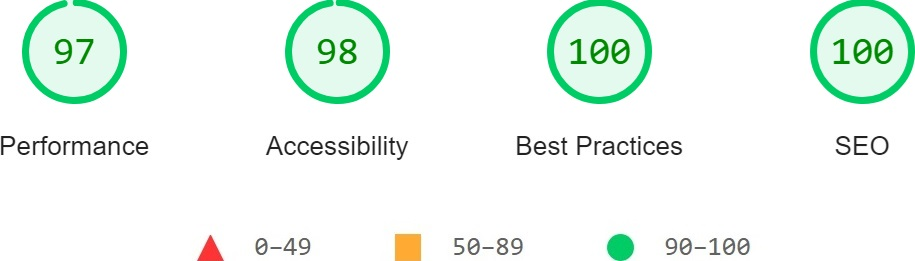

<!-- PROJECT LOGO -->
<div align="center">
  <a href="https://github.com/andreihar/howl">
    
  </a>
  
# Footy AI


<!-- PROJECT SHIELDS -->
[![Contributors][contributors-badge]][contributors]
[![Licence][licence-badge]][licence]
[![LinkedIn][linkedin-badge]][linkedin]

**A website for exploring details about an esports organisation**

A comprehensive platform for the esports team. This React-based application features detailed pages for teams, players, and matches, and includes i18n localisation.

[Live Demo][demo]


</div>


---


<!-- TABLE OF CONTENTS -->
<details open>
  <summary>Table of Contents</summary>
  <ol>
    <li>
      <a href="#about-the-project">About The Project</a>
      <ul>
        <li><a href="#built-with">Built With</a></li>
      </ul>
    </li>
    <li><a href="#install">Install</a></li>
    <li>
      <a href="#features">Features</a>
      <ul>
        <li><a href="#home-page">Home Page</a></li>
        <li><a href="#news">News</a></li>
        <li><a href="#teams">Teams</a></li>
        <li><a href="#team">Team</a>
          <ul>
            <li><a href="#matches">Matches</a></li>
            <li><a href="#achievements">Achievements</a></li>
            <li><a href="#history">History</a></li>
          </ul>
        </li>
        <li><a href="#player">Player</a>
          <ul>
            <li><a href="#setup">Setup</a></li>
          </ul>
        </li>
        <li><a href="#localisation">Localisation</a></li>
      </ul>
    </li>
    <li><a href="#lighthouse-report">Lighthouse Report</a></li>
    <li><a href="#contributors">Contributors</a></li>
    <li><a href="#licence">Licence</a></li>
  </ol>
</details>


<!-- ABOUT THE PROJECT -->
## About The Project

HOWL Gaming is the comprehensive esports organisation website developed after taking a high school Web Design course in Spring 2019.

The original version was created using HTML, CSS, and JavaScript. In a recent update, the website was rewritten using React and the i18n localisation library to reduce the number of pages and have consistent Navbar and Footer styling everywhere on the website.

The website provides detailed information about the team's players, coaches, matches, and achievements. It also includes a news section that covers tournament overviews and detailed match descriptions.

### Built With

* [![NextJS][react-badge]][react]
* [![MaterialUI][react-badge]][react]
* [![i18next][i18next-badge]][i18next]


<!-- INSTALL -->
## Install

Run the app locally:

```bash
$ npm install
$ npm run dev
```

The website can be accessed through the URL `http://localhost:3000/`.


<!-- FEATURES -->
## Features

### Home Page

The Home Page serves as the central hub, directing visitors to the pages of the three teams.

<p align="center">

</p>

### News

The News Page provides an overview of a tournament and detailed descriptions of each match, including scores.

<p align="center">

</p>

<p align="center">

</p>

### Teams

This Teams Page describes the three teams in the organisation, providing links to the team pages and the profiles of the players.

<p align="center">

</p>

### Team

The Team Page provides comprehensive insights into each team, including player details, coaching staff, overall team information, global statistics, match records, achievements, and team history. To ensure efficient content management and prevent duplication, all team-related data is consolidated within a central file `teams.js`. This data is dynamically retrieved and presented on the corresponding team pages, ensuring consistency and ease of updates.

<p align="center">

</p>

#### Matches

The recent and upcoming matches of the team are displayed in convenient container, providing additional information about the tournaments and scores.

<p align="center">

</p>

#### Achievements

The Achievements section displays the significant trophies of the team in various tournaments and competitions.

<p align="center">

</p>

#### History

The History section provides a detailed overview of the team's journey, milestones, and significant events, allowing fans to trace the evolution and growth of the team over time.

<p align="center">

</p>

### Player

The Player Page offers detailed insights into the player's history, setup, and achievements, which are aggregated from all the teams the player is affiliated with. To ensure efficient content management and prevent duplication, all player-related data is consolidated within a central file `players.js`. This data is dynamically retrieved and presented on the corresponding player pages, ensuring consistency and ease of updates.

<p align="center">

</p>

#### Setup

The Setup section provides detailed information about the player's devices, crosshair settings, video configurations, and mouse settings. It also allows to download player's config file.

<p align="center">

</p>

### Localisation

Users can switch between English, Belarusian, and Kazakh languages by selecting the desired option from the language selector drop-down menu in the Navbar. Belarusian has an additional option of switching between Cyrillic and Latin alphabets.

<p align="center">

</p>
<p align="center">

</p>
<p align="center">

</p>


<!-- LIGHTHOUSE -->
## Lighthouse Report

<p align="center">

</p>


<!-- CONTRIBUTORS -->
## Contributors

- Andrei Harbachov ([GitHub][andrei-github] · [LinkedIn][andrei-linkedin])


<!-- LICENCE -->
## Licence

Because HOWL Gaming is MIT-licensed, any developer can essentially do whatever they want with it as long as they include the original copyright and licence notice in any copies of the source code.


<!-- MARKDOWN LINKS -->
<!-- Badges and their links -->
[contributors-badge]: https://img.shields.io/badge/Contributors-1-44cc11?style=for-the-badge
[contributors]: #contributors
[licence-badge]: https://img.shields.io/github/license/andreihar/howl.svg?color=000000&style=for-the-badge
[licence]: LICENSE
[linkedin-badge]: https://img.shields.io/badge/LinkedIn-0077B5?style=for-the-badge&logo=linkedin&logoColor=white
[linkedin]: https://www.linkedin.com/in/andreihar/
[react-badge]: https://img.shields.io/badge/React-087EA4?style=for-the-badge&logo=react&logoColor=ffffff
[react]: https://react.dev/
[i18next-badge]: https://img.shields.io/badge/i18next-26A69A?style=for-the-badge&logo=i18next&logoColor=ffffff
[i18next]: https://www.i18next.com/

<!-- Technical links -->
[demo]: https://footy-ai.andreihar.com/

<!-- Socials -->
[andrei-linkedin]: https://www.linkedin.com/in/andreihar/
[andrei-github]: https://github.com/andreihar