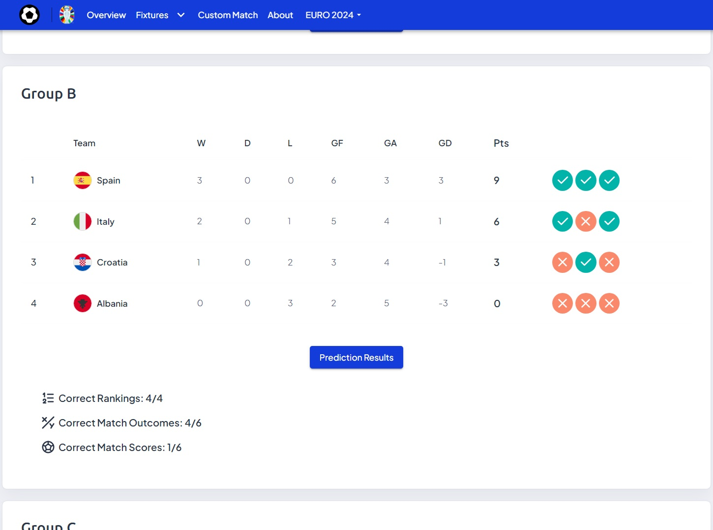
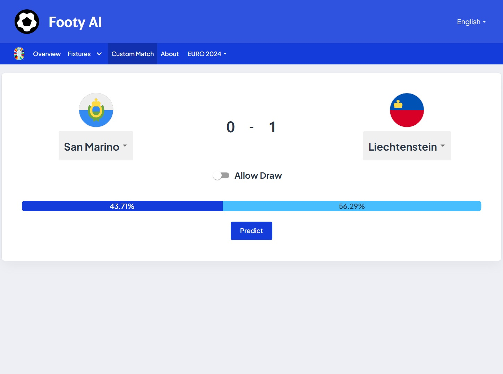

<!-- PROJECT LOGO -->
<div align="center">
  <a href="https://github.com/andreihar/footy-ai">
    
  </a>
  
# Footy AI


<!-- PROJECT SHIELDS -->
[![Contributors][contributors-badge]][contributors]
[![Licence][licence-badge]][licence]
[![LinkedIn][linkedin-badge]][linkedin]

**An end-to-end application for predicting UEFA Euro tournaments**

A comprehensive platform to visualise and interact with AI match predictions. This React-based application features detailed pages of statistics, historical data, language localisations, and more.

**[➤ Live Demo][demo]**


</div>


---


<!-- TABLE OF CONTENTS -->
<details open>
  <summary>Table of Contents</summary>
  <ol>
    <li>
      <a href="#about-the-project">About The Project</a>
      <ul>
        <li><a href="#built-with">Built With</a></li>
      </ul>
    </li>
    <li><a href="#install">Install</a></li>
    <li>
      <a href="#features">Features</a>
      <ul>
        <li><a href="#home-page">Overview Page</a></li>
        <li><a href="#all-matches">All Matches</a></li>
        <li><a href="#group-stage">Group Stage</a></li>
        <li><a href="#knockout-stage">Knockout Stage</a></li>
        <li><a href="#custom-match">Custom Match</a></li>
        <li><a href="#localisation">Localisation</a></li>
        <li><a href="#prediction-model">Prediction Model</a></li>
      </ul>
    </li>
    <li><a href="#lighthouse-report">Lighthouse Report</a></li>
    <li><a href="#contributors">Contributors</a></li>
    <li><a href="#licence">Licence</a></li>
  </ol>
</details>


<!-- ABOUT THE PROJECT -->
## About The Project

Footy AI is a unique end-to-end platform developed in anticipation of the UEFA Euro 2024 tournament.

The application aims to enrich the engagement of football enthusiasts by using artificial intelligence to predict match outcomes and provide insightful statistics based on match and ELO data. In addition to focusing on Euro 2024, the platform offers a retrospective view of past tournaments, allowing users to explore historical odds and performances of their national teams.

Footy AI provides detailed match predictions, comprehensive tournament statistics, and custom match-ups between UEFA national teams. It features interactive visualisations and insights into AI prediction accuracy, offering users a deep dive into football data. The website utilises routing-based localisation and tournament data retrieval, allowing it to be precompiled on the server, which results in optimised loading times and improved SEO for a fast and seamless user experience.

### Built With

* [![NextJS][nextjs-badge]][nextjs]
* [![MUI][mui-badge]][mui]
* [![Next-Intl][next-intl-badge]][next-intl]
* [![sklearn][sklearn-badge]][sklearn]


<!-- INSTALL -->
## Install

Run the app locally:

```bash
$ cd client
$ npm install
$ cp .env.example .env
```

Fill in the required values for title, url, and tournaments range.

```bash
$ npm run dev
```

The website can be accessed through the URL `http://localhost:3000/`.

Open the notebook using your choice software in a terminal or command window. For example, if the software is Jupyter Notebook:

```bash
jupyter notebook server/euro.ipynb
```


<!-- FEATURES -->
## Features

### Overview Page

The Overview Page serves as the central hub, providing a summary of the AI's prediction performance for a certain tournament. Users can see recent predictions and their outcomes, as well as visual representations of the AI's overall and daily prediction accuracy.

<p align="center">

</p>

### All Matches

The All Matches page offers a comprehensive view of all tournament matches with detailed predictions and actual results. It features search parameter-based pagination for seamless navigation between matches while preserving server-side rendering for optimal performance and faster page loading.

<p align="center">

</p>

### Group Stage

The Group Stage Page presents the predicted results for each team within the groups. It includes statistics on the accuracy of the AI's predictions for rankings, match outcomes, and exact scores.

<p align="center">

</p>

### Knockout Stage

The Knockout Stage Page features a bracket view, showing the predicted scores and actual outcomes for each match for the knockout rounds.

<p align="center">

</p>

### Custom Match

The Custom Match Page allows users to create custom match-ups between any two UEFA countries from any historical period of the Euro tournaments. Users can see the AI's predictions for these hypothetical matches, and define whether they want the draw option to be available, providing a fun and interactive way to explore potential outcomes of dream match-ups.

<p align="center">

</p>

### Localisation

Users can switch between all main languages of UEFA by selecting the desired option from the language selector drop-down menu in the Navbar.

<p align="center">


</p>

### Prediction Model

Footy AI uses a robust prediction model using Linear Regression to predict goal differences based on ELO differences. Linear Regression is chosen for its simplicity and effectiveness in modelling the relationship between ELO ratings and goal differences. The model is trained on the [International football results][results] dataset, and incorporates [ELO Ratings from 1901 to 2024][elo]. Expected Goals (xG) are used to normalise goal scoring based on team performance, serving as the main prediction attribute. ELO Ratings quantify team strength, allowing the model to account for the relative strengths of the teams, leading to more accurate predictions. To reflect the random nature of goal scoring, Poisson Distribution is used to simulate match scores. The model uses data from all international matches over the past four years from the starting date of the tournament, so as to consider semi-major player changes. The prediction percentages are determined after simulating 10,000 matches.


<!-- LIGHTHOUSE -->
## Lighthouse Report

<p align="center">

</p>


<!-- CONTRIBUTORS -->
## Contributors

- Andrei Harbachov ([GitHub][andrei-github] · [LinkedIn][andrei-linkedin])


<!-- LICENCE -->
## Licence

Because Footy AI is MIT-licensed, any developer can essentially do whatever they want with it as long as they include the original copyright and licence notice in any copies of the source code.


<!-- MARKDOWN LINKS -->
<!-- Badges and their links -->
[contributors-badge]: https://img.shields.io/badge/Contributors-1-44cc11?style=for-the-badge
[contributors]: #contributors
[licence-badge]: https://img.shields.io/github/license/andreihar/footy-ai.svg?color=000000&style=for-the-badge
[licence]: LICENSE
[linkedin-badge]: https://img.shields.io/badge/LinkedIn-0077B5?style=for-the-badge&logo=linkedin&logoColor=white
[linkedin]: https://www.linkedin.com/in/andreihar/
[nextjs-badge]: https://img.shields.io/badge/Next.js-171717?style=for-the-badge&logo=nextdotjs&logoColor=ffffff
[nextjs]: https://nextjs.org/
[mui-badge]: https://img.shields.io/badge/MUI-007FFF?style=for-the-badge&logo=mui&logoColor=ffffff
[mui]: https://mui.com/
[next-intl-badge]: https://img.shields.io/badge/Next--Intl-5FC3E7?style=for-the-badge&logo=atandt&logoColor=ffffff
[next-intl]: https://next-intl-docs.vercel.app/
[sklearn-badge]: https://img.shields.io/badge/sklearn-f89a36?style=for-the-badge&logo=scikitlearn&logoColor=ffffff
[sklearn]: https://scikit-learn.org/stable/

<!-- Technical links -->
[demo]: https://footy-ai.andreihar.com/
[results]: https://www.kaggle.com/datasets/martj42/international-football-results-from-1872-to-2017
[elo]: https://www.eloratings.net/

<!-- Socials -->
[andrei-linkedin]: https://www.linkedin.com/in/andreihar/
[andrei-github]: https://github.com/andreihar